# Sunrise MDM — Database Design (PHASE 5)

PostgreSQL 16+. Every tenant-owned table carries `tenant_id` and is protected by
**Row-Level Security** (`tenant_id = current_setting('app.tenant_id')`). Hot tables
(`audit_logs`, `events`, `command_results`, `patch_results`) are partitioned.

## 1. Conventions
- UUID primary keys (`gen_random_uuid()`).
- Timestamps: `created_at`, `updated_at` (timestamptz). Soft deletes via `deleted_at`.
- Audit: every row mutation also writes `audit_logs` (actor, tenant, action, before/after).
- Tenant-scoped FK enforcement via composite `(tenant_id, id)` pattern where needed.
- Migration tool: golang-migrate, forward-only.

## 2. Core Schema

### tenancy & identity
- **organizations** — the tenant. `id, name, slug, status, region, created_at, updated_at`
- **users** — `id, tenant_id, email, display_name, status, keycloak_sub, mfa_enabled, last_login_at`
- **departments** — `id, tenant_id, parent_id, name, code`
- **roles** — `id, name, description, is_system` (Super Admin, IT Admin, Helpdesk, Asset Manager, Security Admin, Read Only, Auditor)
- **permissions** — `id, code, description` (e.g. `devices:read`, `jobs:create`, `patches:approve`)
- **role_permissions** — `id, role_id, permission_id`
- **user_roles** — `id, user_id, role_id, tenant_id, department_ids jsonb, scope` (scoped roles)

### devices & agents
- **devices** — `id, tenant_id, device_uuid, asset_id nullable, hostname, os (macos|windows), os_version, os_build, kernel, manufacturer, model, serial_number, cpu, ram_mb, storage_mb, gpu, mac_address, ip_address, last_seen, online bool, first_seen, enrolled_at, status, tags jsonb, department_id nullable, assigned_user_id nullable, location, location_consent bool, encryption_status, battery_health, agent_version, compliance_score, deleted_at`
- **device_network** — `id, device_id, iface, ipv4, ipv6, mac, ssid, gateway, is_primary, captured_at`
- **device_login_events** — `id, tenant_id, device_id, username, type (login|logout|lock), occurred_at`
- **device_location_events** — `id, tenant_id, device_id, lat, lon, source, consent_verified, captured_at` (only for consenting devices; retention-purged)
- **assets** — `id, tenant_id, asset_tag, serial_number, hostname, manufacturer, model, device_id nullable, vendor, purchase_date, warranty_until, warranty_status, assigned_user_id, department_id, location, status (extended lifecycle enum), current_value_usd nullable, deleted_at`
- **asset_history** — `id, tenant_id, asset_id, field, old_value, new_value, changed_by_user_id, changed_by, occurred_at`
- **device_groups** — `id, tenant_id, name, description, kind (static|dynamic|tag), parent_id nullable, is_system`
- **device_group_members** — `id, group_id, device_id` (static; dynamic computed at query time)
- **device_group_rules** — `id, group_id, dimension, operator, value jsonb` (os, os_version, department, user, location, compliance_status, installed_software, manufacturer, model, tag)
- **tags** — `id, tenant_id, name, color`

### software & packages
- **software** — `id, tenant_id, name, publisher, category, is_approved`
- **software_versions** — `id, software_id, version, release_date, is_latest`
- **device_software** — `id, tenant_id, device_id, software_id, version, install_path, package_id, publisher, install_date, detected_at`
- **software_usage** — `id, tenant_id, device_id, software_id, user_id nullable, launches, active_seconds, day` (metering, consent-gated)
- **packages** — `id, tenant_id, name, software_id, platform, file_key, sha256, size_bytes, signature, install_command, uninstall_command, detection_rule jsonb, deployment_type (required|optional), version, reboot_required bool, source, created_by_user_id, status`
- **deployments** — `id, tenant_id, package_id, ring, status, created_by_user_id, approved_by_user_id nullable, scheduled_for, started_at, completed_at`
- **deployment_targets** — `id, deployment_id, device_id, group_id nullable, status, result`

### policies & compliance
- **policies** — `id, tenant_id, name, description, type (password|encryption|firewall|screen_lock|os_min_version|antivirus|usb|software_requirement|auto_update), config jsonb, precedence int, active bool, created_by_user_id`
- **policy_assignments** — `id, tenant_id, policy_id, target_type (org|department|group|device), target_id, inherited bool`
- **compliance** — `id, tenant_id, device_id, policy_id, status (compliant|non_compliant|unknown|not_applicable), details jsonb, evaluated_at`
- **compliance_snapshots** — `id, tenant_id, device_id, snapshot jsonb, captured_at` (daily baseline)

### commands & jobs
- **commands** — command library. `id, tenant_id, name, code, platform (macos|windows), category, risk (low|medium|high|critical), args_schema jsonb, timeout_seconds, max_retries, requires_approval bool, approved_for_roles jsonb, description, active`
- **jobs** — `id, tenant_id, command_id nullable, package_id nullable, target_type, target_ids jsonb, status (pending|approved|queued|delivered|running|completed|failed|expired|cancelled), risk, requires_approval, approved_by_user_id, created_by_user_id, confirmation_payload jsonb, scheduled_for, expires_at, created_at, updated_at`
- **job_targets** — `id, job_id, device_id, status, delivered_at, started_at, completed_at`
- **command_results** — `id, tenant_id, job_id, job_target_id, device_id, exit_code, stdout, stderr, error, duration_ms, attempt, status, collected_at` (partitioned)
- **job_results** — alias view/table aggregating command/package/patch results per job per device

### agent lifecycle
- **agents** — `id, tenant_id, device_id, version, os, arch, installed_at, last_seen, status, update_state`
- **agent_versions** — `id, version, platform, arch, file_key, sha256, signature, released_at, ring, active`
- **device_tokens** — `id, tenant_id, device_id, token_hash, expires_at, revoked_at, purpose`
- **enrollment_tokens** — `id, tenant_id, token_hash, created_by_user_id, expires_at, max_uses, used_count, revoked_at`

### audit, notifications, api
- **audit_logs** — `id, tenant_id, user_id nullable, device_id nullable, actor_type (admin|agent|system), action, resource_type, resource_id, before jsonb, after jsonb, ip, user_agent, occurred_at` (partitioned, retained per policy)
- **notifications** — `id, tenant_id, event_type, channel, targets jsonb, payload jsonb, status, sent_at, delivered_at`
- **api_keys** — `id, tenant_id, name, key_hash, prefix, scopes jsonb, created_by_user_id, expires_at, revoked_at, last_used_at`
- **maintenance_windows** — `id, tenant_id, name, target_type, target_id, days jsonb, start_time, end_time, timezone`

### patch management (see PATCH-MANAGEMENT.md)
- **patches** — `id, tenant_id, source (apple|windows_update|msrc|custom), title, description, severity (critical|high|medium|low|informational), category (os|security|critical|feature|firmware|third_party|agent|custom), kb_number, release_date, target_os, reboot_required bool, supersedes jsonb, superseded_by jsonb, rollback_supported bool, rollback_method jsonb, download_url nullable, install_method jsonb, detection_rule jsonb, status (discovered|approved|scheduled|downloading|installing|reboot_required|completed|failed|rolled_back), risk_score`
- **patch_versions** — `id, patch_id, version, build, available_from, is_installed`
- **patch_products** — `id, patch_id, product (os|chrome|…), product_version`
- **patch_cves** — `id, patch_id, cve_id, cvss_score, severity, description, fixed_version`
- **patch_packages** — `id, patch_id, package_id nullable, file_key, sha256, signature, install_command, uninstall_command, reboot_required`
- **patch_policies** — `id, tenant_id, name, severity, approval (automatic|manual|emergency), rings jsonb, delay_hours, maintenance_window_id, max_retries, force_reboot bool, user_notification jsonb, target_type, target_id, active, auto_approve_rules jsonb`
- **patch_deployments** — `id, tenant_id, patch_id, policy_id, ring, status, scheduled_for, created_by, approved_by, started_at, completed_at, promoted_to`
- **patch_deployment_targets** — `id, deployment_id, device_id, group_id nullable, status, result`
- **patch_results** — `id, tenant_id, patch_id, deployment_id, device_id, status, exit_code, logs, failure_reason, recommended_action, attempts, reboot_status, captured_at` (partitioned)
- **patch_exclusions** — `id, tenant_id, patch_id, device_id nullable, group_id nullable, reason, requested_by_user_id, approved_by_user_id, created_at, expires_at`
- **patch_approvals** — `id, tenant_id, patch_id, deployment_id nullable, action (approve|reject|pause|resume|cancel), approver_user_id, notes, decided_at`
- **patch_maintenance_windows** — reuse `maintenance_windows` + `patch_deployments.maintenance_window_id`
- **patch_reboots** — `id, tenant_id, device_id, patch_id, deployment_id, status (required|deferred|scheduled|forced|completed), deadline, deferred_by_user_id, notified_at, forced_at, completed_at`

## 3. ER Diagram

```mermaid
erDiagram
  organizations ||--o{ users : has
  organizations ||--o{ departments : has
  departments ||--o{ users : has
  users ||--o{ user_roles : has
  roles ||--o{ user_roles : grants
  roles ||--o{ role_permissions : has
  permissions ||--o{ role_permissions : grants

  organizations ||--o{ devices : has
  devices ||--o{ device_network : has
  devices ||--o{ device_login_events : logs
  devices ||--o{ device_location_events : logs
  devices ||--o{ agents : runs
  agents ||--o{ agent_versions : tracks
  devices ||--o{ device_tokens : has
  organizations ||--o{ enrollment_tokens : issues

  devices ||--o| assets : mapped_to
  assets ||--o{ asset_history : has
  devices ||--o{ device_software : has
  software ||--o{ software_versions : has
  software_versions ||--o{ device_software : version_of
  software ||--o{ software_usage : metered
  organizations ||--o{ packages : has
  software ||--o{ packages : packaged_as
  packages ||--o{ deployments : deployed_in
  deployments ||--o{ deployment_targets : has
  deployment_targets }o--|| devices : targets

  organizations ||--o{ device_groups : has
  device_groups ||--o{ device_group_members : contains
  device_groups ||--o{ device_group_rules : evaluated_by

  organizations ||--o{ policies : has
  policies ||--o{ policy_assignments : assigned_to
  devices ||--o{ compliance : evaluated
  policies ||--o{ compliance : checks

  organizations ||--o{ commands : has
  commands ||--o{ jobs : instantiates
  jobs ||--o{ job_targets : has
  job_targets ||--o{ command_results : produces
  jobs ||--o{ job_results : aggregates

  organizations ||--o{ maintenance_windows : has
  organizations ||--o{ audit_logs : records
  organizations ||--o{ notifications : sends
  organizations ||--o{ api_keys : has

  organizations ||--o{ patches : catalogs
  patches ||--o{ patch_versions : has
  patches ||--o{ patch_products : affects
  patches ||--o{ patch_cves : fixes
  patches ||--o{ patch_packages : ships_as
  patches ||--o{ patch_exclusions : excluded_by
  patches ||--o{ patch_approvals : approved_by
  patch_policies ||--o{ patch_deployments : drives
  patch_deployments ||--o{ patch_deployment_targets : has
  patch_deployment_targets }o--|| devices : applies_to
  patches ||--o{ patch_results : evaluated_by
  patches ||--o{ patch_reboots : requires
```

## 4. Indexing & Partitioning Notes
- Index: `devices(tenant_id, status)`, `devices(tenant_id, os)`, `devices(tenant_id, hostname)`, `devices(serial_number)` unique per tenant.
- Partition `audit_logs`, `command_results`, `patch_results`, `device_location_events` by month.
- GIN index on `device_group_rules.value`, `devices.tags`, `policy_assignments` composite.
- Unique: `(tenant_id, serial_number)` for devices; `(tenant_id, code)` for commands/roles/permissions.
